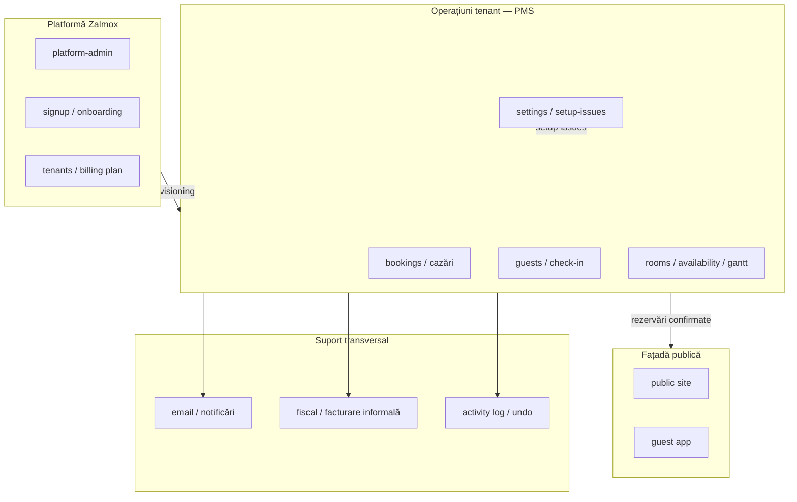

# DDD — Zalmox PMS

Audit orientativ (2026). Nu este o țintă de rewrite complet — documentează cum stă codul și unde merită îmbunătățiri pragmatice.

## Hartă de contexte (Bounded Contexts)



| Context | Locație principală | Limbaj ubiquitar |
|---------|-------------------|------------------|
| **Operațiuni tenant** | `src/app/.../admin`, `src/services/bookings`, `src/services/checkin`, `src/domain/booking`, `src/domain/checkin`, `src/domain/cazari` | cerere, confirmată, anulată, cazare, oaspete, pensiune |
| **Platformă** | `src/app/.../platform-admin`, `src/services/platform-admin.ts`, `src/core/` | tenant, plan, impersonate |
| **Site public / guest app** | `src/features/public-site`, `src/features/guest-app`, `src/domain/guest-app`, `src/domain/public-site` | cod stay, acces oaspete, milestone |
| **Email** | `src/lib/email`, `src/domain/email`, `src/services/email-*` | from-address, template |
| **Fiscal** | `src/domain/fiscal`, `src/domain/invoice`, `src/domain/accounting`, `src/services/issued-invoice.ts` | CUI, TVA, factură informală, export SAGA |

### Relații între contexte

- **Shared kernel (parțial):** `BookingStatus`, `BookingRow`, date ISO, `tenant` scope — în `src/domain/booking`, `src/domain/tenant`, `src/lib/stay-dates`.
- **Anti-corruption:** mapări Supabase → `BookingRow` în `src/services/bookings/map.ts`; guest-app folosește `access-rules` separate de admin.
- **Conformist:** majoritatea serviciilor accesează direct Supabase, nu porturile din `src/core/ports/repository.ts` (hexagonal parțial, neadoptat în fluxul principal).

## Straturi

### `src/domain/` (~200 fișiere)

| Aspect | Evaluare |
|--------|----------|
| **Puritate** | Bună în check-in, availability, gantt, cazări — fără importuri din `services/` sau DB |
| **Dependențe acceptate** | `@/lib/stay-dates`, `@/lib/constants` — utilitare pure; câteva legături `lib/auth` în setup-issues |
| **Stil** | **Funcțional / rich functions**, nu entități OO — tipuri anemice (`BookingStatus`, `BookingRow`) + logică în module |
| **Teste** | Acoperire solidă pe reguli critice (validate check-in, conflict camere, page-splits, stay-card-display) |

### `src/services/` (~100 fișiere)

Rol de **application services**: orchestrare DB, cache, auth, activity log. Apelează `domain/` pentru reguli, dar **invariantele de tranziție** erau duplicate în `lifecycle.ts` / `create.ts` → centralizate în `domain/booking/lifecycle-guards.ts`.

**God services** (linii mari, multiple responsabilități): `bookings/queries.ts` (~600), `rooms-admin.ts`, `room-catalog.ts`, `guest-profiles.ts` — query + map + logică amestecată.

### UI (`src/app`, `src/components`, `src/features`)

- **page.tsx:** în general compunere + apel servicii; logică de prezentare delegată la domain (ex. `cazari/page.tsx` → `page-splits`, `horizon`).
- **Componente:** `CheckinStepper` apelează `validateCheckin` din domain (corect); unele componente gantt compară direct `status === "confirmata"` (UI, acceptabil).

## Agregate și invariante

| Agregat | Unde trăiește | Invariante |
|---------|---------------|------------|
| **Booking** | DB `bookings` + `booking_rooms`; tip `BookingRow` | Conflict camere: `domain/booking/conflict`, `domain/occupancy/conflict`; confirmare: `lifecycle-guards`; post-checkout: `post-checkout-edit`; check-in: `domain/checkin/validate` |
| **Guest** | `guests` + profil | CNP, dedup: `domain/guest/*`; matching: `match-guest` |
| **Tenant** | `tenants`, `tenant_members` | Roluri: `domain/tenant/types`, `team-permissions`; scope: `lib/tenant/scope` |

Nu există entități `Booking.confirm()` — tranzițiile sunt în servicii cu guard-uri domain.

## Ce funcționează bine

1. **setup-issues** — reguli pure, testate, UX onboarding coerent.
2. **cazari/page-splits** + **page-lists** — separare domain / loader; limbaj `cereri` / `confirmate`.
3. **stay-card-display** — proiecție UI gantt fără DB.
4. **checkin/validate** — specificație business documentată, testată extensiv.
5. **settings-completion**, **public-site/resolve-config** — reguli de completare reutilizabile în preview și live.
6. **BookingRow** în `domain/booking/row.ts` — shared kernel pentru gantt, cazări, liste.

## Anti-pattern-uri observate

| Pattern | Severitate | Exemplu |
|---------|------------|---------|
| Logică duplicată în servicii | Mediu | ~~status confirmare în lifecycle + create~~ → `lifecycle-guards` |
| Anemic types + rich functions | Scăzut (intenționat) | `BookingStatus` e string union; comportament în module |
| God services | Mediu | `bookings/queries.ts`, `room-catalog.ts` |
| Hexagonal nefolosit | Scăzut | `core/ports` există; fluxul folosește Supabase direct |
| Domain în componente mari | Mediu | `CheckinStepper` — multe importuri domain, dar delegă validarea |
| Email templates în `lib/` | Scăzut | prezentare HTML, nu reguli business |

## Scor: **6.5 / 10**

Pentru un PMS Next.js pragmatic: **peste medie**. Domain layer real, testat, cu limbaj românesc consistent. Nu e DDD clasic (fără agregate OO, fără repository peste tot), dar structura susține evoluția fără rewrite.

## Top 5 îmbunătățiri pragmatice

1. **Extrage guard-uri de lifecycle booking** — făcut: `domain/booking/lifecycle-guards.ts`.
2. **Mută `stay-dates` în `domain/time` sau `domain/shared`** — reduce confuzia „e lib sau domain?”.
3. **Împarte `bookings/queries.ts`** — queries vs map vs filtre operative.
4. **Policy object pentru check-in** — `CheckinPolicy` din settings + booking, folosit de validate și servicii.
5. **Adoptă treptat `core/ports`** pentru entități noi sau migrare SQLite — un context la un moment.

## Fișiere cheie

```
src/domain/booking/     — status, conflict, lifecycle-guards, row
src/domain/checkin/     — validate, identity, fisa turist
src/domain/cazari/      — page-splits, horizon, stay-search
src/domain/setup-issues/— checks, progress, paths
src/domain/gantt/       — stay-card-display, calendar-derivations
src/services/bookings/  — application layer rezervări
src/core/ports/         — contracte viitoare (hexagonal)
```
