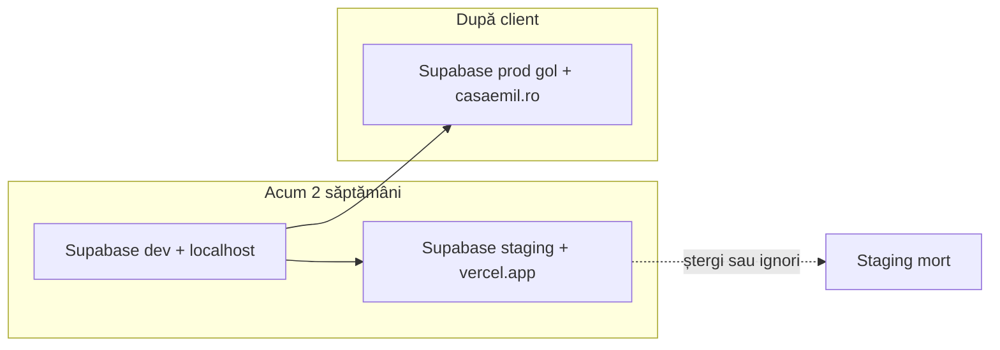

# Mediu test live (~2 săptămâni)

> **Hospira (signup + subdomenii tenant):** ghid actualizat → **[test-domeniu-hospira.md](./test-domeniu-hospira.md)**  
> (Supabase Cloud, `test.hospira.ro`, `*.test.hospira.ro`, Vercel — fără localhost)

Scop: **URL stabil** + **bază de date doar de test**, separată de dev-ul tău zilnic și de producția clientului. Prietenul (sau oricine) poate folosi app-ul ca în realitate, fără să atingă datele importante.

## Arhitectură (3 straturi)

| Strat | Ce folosești | De ce |
|-------|----------------|-------|
| **Local** | `.env.local` → Supabase personal (dev) | Tu dezvolți |
| **Staging live** | Vercel + `.env.staging.local` → proiect `casa-emil-staging` | 2 săptămâni feedback |
| **Producție** | `casaemil.ro` + Supabase client | Când e gata PFA-ul |

Staging = **același cod**, **alt proiect Supabase**, **alt URL**.

---

## Pas 1 — Proiect Supabase nou (staging)

1. [supabase.com](https://supabase.com) → **New project** (ex. `casa-emil-staging`, regiune EU).
2. **SQL Editor** → rulează migrările **în ordine**, câte un fișier:
   - `supabase/migrations/001_pension_core.sql`
   - `002_buildings_ac_mode.sql`
   - `003_bookings.sql`
   - `004_guest_name_parts.sql`
   - `005_statistics_foundation.sql`  
   Sunt idempotente (`if not exists`) — safe la re-run.
3. După `001` ai deja clădiri/camere demo (Tășnad pilot).
4. **Settings → API** → copiază URL, `anon`, `service_role`.

---

## Pas 2 — Auth Supabase pentru URL-ul live

**Authentication → URL configuration**

| Câmp | Valoare (exemplu) |
|------|-------------------|
| Site URL | `https://casa-emil-staging.vercel.app` |
| Redirect URLs | același URL + `https://*.vercel.app/**` (preview opțional) |

Fără asta, login-ul admin pe staging poate eșua după deploy.

---

## Pas 3 — Fișier env local pentru staging

```bash
cp .env.staging.example .env.staging.local
# completează cheile din Supabase staging
```

Creează cont admin pe **staging** (nu pe dev):

```bash
npm run setup-admin:staging
```

Login în app: utilizator **Admin**, parola din `ADMIN_INITIAL_PASSWORD`.

---

## Pas 4 — Deploy Vercel (staging separat de prod)

Recomandat: **al doilea proiect Vercel** pe același repo GitHub.

1. [vercel.com](https://vercel.com) → **Add New Project** → import `casa-emil`.
2. Nume proiect: ex. `casa-emil-staging`.
3. **Environment Variables** (Production) — din `.env.staging.local`:

   - `NEXT_PUBLIC_SUPABASE_URL`
   - `NEXT_PUBLIC_SUPABASE_ANON_KEY`
   - `SUPABASE_SERVICE_ROLE_KEY`
   - `ADMIN_EMAIL` (opțional, default `admin@casaemil.ro`)
   - `NEXT_PUBLIC_PENSION_NAME` (ex. `Casa Emil (test)`)

4. **Deploy** → notează URL: `https://casa-emil-staging.vercel.app`.
5. Revino la **Pas 2** în Supabase dacă URL-ul e diferit de ce ai pus la Site URL.

### Opțional: subdomeniu

În Vercel → Domains → `test.casaemil.ro` (DNS CNAME). Actualizează Site URL în Supabase la noul domeniu.

### Workflow pe 2 săptămâni

- Tu lucrezi local cu `.env.local` (dev).
- Când vrei să actualizezi staging: `git push` → Vercel redeploy automat.
- Prietenul folosește **doar** URL-ul staging — nu localhost.

---

## Pas 5 — Ce trimiți prietenului

Mesaj scurt (copy-paste):

```
Site test (2 săptămâni):
https://casa-emil-staging.vercel.app

Admin: https://.../admin/login
Utilizator: Admin
Parolă: [parola staging — doar test]

Ca oaspete: Calendar de pe homepage.
Date fictive / test — poți șterge, confirma, experimenta.

Feedback: ce e confuz, ce lipsește, ce ai face mai repede decât Excel.
```

**Nu** trimite: `service_role`, chei API, acces dashboard Supabase.

---

## Întreținere staging

### Golire rezervări (păstrează camerele)

```bash
npm run reset-staging-bookings -- --yes
```

### Schimbat parola admin staging

1. Pune parola nouă în `.env.staging.local` → `ADMIN_INITIAL_PASSWORD`.
2. `npm run setup-admin:staging`
3. Spune-i prietenului noua parolă.

### La finalul celor ~2 săptămâni

1. Schimbă parola admin staging (sau șterge userul din Supabase Auth).
2. Opțional: oprește deploy Vercel (Settings → Pause) sau lasă proiectul pentru următorul test.
3. **Nu** promova staging la prod — prod = proiect Supabase nou client (vezi `DEV-migrare.md`).

---

## Securitate

- Staging DB = doar date de test; evită nume/telefoane reale ale clienților.
- Un singur cont admin partajat e OK pentru perioada scurtă; nu e cont „prieten” separat (poate fi adăugat ulterior).
- `SUPABASE_SERVICE_ROLE_KEY` doar pe Vercel / în `.env.staging.local` — niciodată în chat.

---

## Checklist rapid

- [ ] Proiect Supabase `casa-emil-staging`
- [ ] Migrări 001–005 rulate
- [ ] `.env.staging.local` + `npm run setup-admin:staging`
- [ ] Proiect Vercel staging cu env vars
- [ ] Supabase Auth Site URL = URL Vercel
- [ ] Link + parolă trimise prietenului
- [ ] Parolă schimbată la final

---

# Ghid detaliat (pas cu pas)

## Pas 1 — Supabase staging (15–30 min)

### 1.1 Creează proiectul

1. Intră pe [supabase.com/dashboard](https://supabase.com/dashboard).
2. **New project**:
   - **Name:** `casa-emil-staging`
   - **Database password:** notează-o undeva (pentru SQL direct; app-ul folosește API keys).
   - **Region:** `Central EU (Frankfurt)` sau ce e mai aproape de RO.
3. Așteaptă ~2 minute până e „Active”.

### 1.2 Rulează migrările

1. În proiect → **SQL Editor** → **New query**.
2. Deschide pe PC `supabase/migrations/001_pension_core.sql`, copiază **tot** conținutul, lipește, **Run**.
3. Repetă pentru `002`, `003`, `004`, `005` — **strict în ordine**.
4. Dacă apare eroare „already exists”, de obicei e OK (migrările sunt idempotente).
5. Verificare rapidă: **Table Editor** → ar trebui să vezi `buildings`, `rooms`, `bookings`, etc., plus 2 clădiri demo din `001`.

### 1.3 Copiază cheile API

1. **Project Settings** (roată) → **API**.
2. Notează:
   - **Project URL** → `NEXT_PUBLIC_SUPABASE_URL`
   - **anon public** → `NEXT_PUBLIC_SUPABASE_ANON_KEY`
   - **service_role** → `SUPABASE_SERVICE_ROLE_KEY` (secret — nu trimite prietenului)

---

## Pas 2 — Fișier env + admin (5 min)

În folderul proiectului (PowerShell):

```powershell
cd C:\Users\Administrator\Desktop\CasaEmil
Copy-Item .env.staging.example .env.staging.local
```

Deschide `.env.staging.local` și completează cele 3 chei Supabase + parolă:

```env
ADMIN_INITIAL_PASSWORD=O-parola-doar-pentru-test-2026
```

Apoi:

```powershell
npm run setup-admin:staging
```

Ar trebui să vezi: `Cont creat: admin@casaemil.ro` sau `Cont existent actualizat`.

Test local (opțional) — poți temporar copia cheile staging în `.env.local` și `npm run dev`, dar **nu e obligatoriu**; important e Vercel mai jos.

---

## Pas 3 — Supabase Auth (5 min) — după ce ai URL Vercel

**Poți face acum cu un URL provizoriu și îl actualizezi după deploy**, sau revii după Pas 4.

1. Supabase staging → **Authentication** → **URL configuration**.
2. **Site URL:** exact URL-ul public (ex. `https://casa-emil-staging.vercel.app`).
3. **Redirect URLs** — adaugă pe rând:
   - `https://casa-emil-staging.vercel.app/**`
   - `https://*.vercel.app/**` (dacă vrei preview deploys)
4. **Save**.

Dacă login-ul dă „redirect” greșit după deploy, 99% Site URL nu e identic cu domeniul din browser.

---

## Pas 4 — Vercel staging (20–40 min)

### 4.1 Pregătire Git

Staging se deploy-uiește din același cod ca produl:

```powershell
git add .
git commit -m "docs: staging setup"
git push origin main
```

(Dacă nu ai remote GitHub încă, creează repo privat și `git remote add origin ...`.)

### 4.2 Proiect Vercel separat

1. [vercel.com](https://vercel.com) → **Add New…** → **Project**.
2. Import repository-ul `casa-emil`.
3. **Project Name:** `casa-emil-staging` (alt nume decât viitorul prod).
4. Framework: Next.js (detectat automat).
5. **Environment Variables** → pentru **Production** (și bifează Preview dacă vrei același DB la preview):

   | Name | Value |
   |------|--------|
   | `NEXT_PUBLIC_SUPABASE_URL` | din staging Supabase |
   | `NEXT_PUBLIC_SUPABASE_ANON_KEY` | anon key |
   | `SUPABASE_SERVICE_ROLE_KEY` | service_role |
   | `ADMIN_EMAIL` | `admin@casaemil.ro` |
   | `NEXT_PUBLIC_PENSION_NAME` | `Casa Emil (test)` |

6. **Deploy** → așteaptă build verde.
7. Copiază URL-ul: ex. `https://casa-emil-staging.vercel.app`.

### 4.3 Leagă Auth de URL

Revino la **Pas 3** și pune Site URL = URL-ul Vercel real.

### 4.4 Test tu înainte de prieten

1. Deschide `https://....vercel.app/admin/login`
2. User **Admin**, parola din `ADMIN_INITIAL_PASSWORD`
3. Verifică: clădiri, calendar, disponibilitate, o cerere de pe `/calendar`

---

## Pas 5 — Mesaj pentru prieten

```
Salut — site test Casa Emil (date fictive, 2 săptămâni):

Site: https://casa-emil-staging.vercel.app
Admin: https://casa-emil-staging.vercel.app/admin/login
User: Admin
Parolă: [parola ta de test]

Încearcă:
1) Ca oaspete: Calendar → alege date → trimite cerere
2) Ca admin: confirmă/respinge, calendar Gantt, Disponibilitate

Spune-mi ce e confuz sau lent. Mulțumesc!
```

---

# După test: ștergi link-ul staging? Domeniu? Client de la zero?

## Răspuns scurt

| Întrebare | Răspuns |
|-----------|---------|
| Pot șterge link-ul `*.vercel.app` de staging? | **Da** — oprești/ștergi proiectul Vercel staging sau îl lași mort. |
| Merge apoi pe `casaemil.ro`? | **Da** — domeniul se leagă la un proiect Vercel **prod** (sau Cloudflare Pages), cu env vars către **alt** Supabase. |
| Clientul pornește de la 0 pe baza lui? | **Da, recomandat** — proiect Supabase **nou** pe contul lui; rulezi aceleași migrări 001–005; **nu** muți automat datele din staging. |

Staging **nu devine** producția. E un sandbox de 2 săptămâni.

## Cele 3 baze de date (să nu se amestece)

```
casa-emil-dev        ← tu, zilnic, .env.local, localhost
casa-emil-staging    ← prieten, 2 săpt., Vercel staging URL
casa-emil-prod       ← client, casaemil.ro, cont Supabase al lui
```

Poți șterge staging Supabase + Vercel staging după feedback — **zero impact** pe prod, dacă prod folosește alt proiect.

## După cele ~2 săptămâni (închidere staging)

1. **Schimbă parola** admin pe staging sau șterge userul: Supabase → Authentication → Users.
2. **Vercel:** proiect `casa-emil-staging` → Settings → poți **Remove Project** sau lăsa paused (nu mai costă mult, dar linkul încă există dacă nu ștergi).
3. **Supabase staging:** opțional **Pause project** (plan) sau lași gol — nu plătești mult pentru DB mic de test.
4. Spune prietenului că linkul nu mai e activ.

Linkul `casa-emil-staging.vercel.app` **nu se transformă** singur în `casaemil.ro` — sunt două proiecte Vercel (sau același proiect cu schimbare env, dar mai clar: **două proiecte**).

## Producție: `casaemil.ro` + baza clientului de la zero

Când PFA-ul e gata:

### A. Supabase producție (gol, curat)

1. Client creează cont Supabase (ex. `office@casaemil.ro`) sau îi creezi tu proiectul pe contul lui.
2. Proiect nou: ex. `casa-emil-prod` — **nu** refolosi `casa-emil-staging`.
3. SQL Editor: rulezi din nou **001 → 005** (structură goală + seed demo din 001).
4. Clientul configurează în UI admin: clădiri reale, camere, prețuri — **de la zero**, date reale.
5. `npm run setup-admin` cu `.env` prod (sau script cu fișier env prod) → parolă **nouă**, doar pentru client.

**Ce NU copiezi din staging:** rezervările de test, numele fictive, experimentele prietenului.  
**Ce copiezi:** doar **codul** (Git) + **migrările SQL** — deja în repo.

### B. Deploy producție

1. Vercel → proiect nou `casa-emil` (sau `casa-emil-prod`) — **alt** decât staging.
2. Environment variables → chei din **Supabase prod**.
3. **Domains** → adaugi `casaemil.ro` și `www.casaemil.ro` (DNS la registrar: CNAME/A conform Vercel).
4. Supabase prod → Auth → Site URL = `https://casaemil.ro`.

### C. Opțional: păstrezi `test.casaemil.ro`

- Subdomeniu pe **același** proiect Vercel staging sau pe prod cu env preview — doar dacă mai vrei un sandbox; nu e obligatoriu.

## Diagramă viață



## Greșeli de evitat

- Să pui cheile **staging** pe proiectul Vercel care servește `casaemil.ro` — oaspeții ar scrie în DB de test.
- Să „promovezi” staging la prod fără proiect Supabase nou — amesteci date fictive cu rezervări reale.
- Să uiți să schimbi **Site URL** în Supabase la fiecare domeniu nou.

## Dacă vrei să salvezi ceva din staging

Doar dacă ai configurat manual clădiri/camere **reale** în staging și nu vrei să le reintroduci:

- export CSV din Table Editor, sau
- script SQL export — rar necesar; de obicei **reconfigurezi în prod** în 30 min din admin.

Pentru pensiune, **prod de la zero** e cel mai curat.
